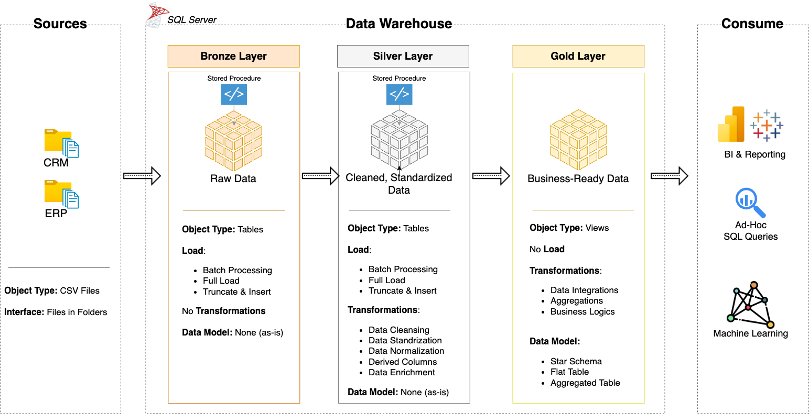

# EUETRADE Data Warehouse Project

* This project demonstrates a data warehouse implementation using the Medallion architecture on SQL Server. It consolidates e-commerce sales data from ERP and CRM systems, transforming raw CSV files into a business-ready star schema for analytical reporting and decision-making.
---
## Architecture
The architectural design implements Medallion Architecture via Bronze, Silver, and Gold data layers:

---
## Business Objective
Develop a modern data warehouse on SQL Server to consolidate e-commerce sales data from ERP and CRM, enabling analytical reporting and informed decision-making.

### Specifications
- **Data Sources:** Import from ERP and CRM systems provided as CSV files.
- **Data Quality:** Cleanse, deduplicate, and resolve quality issues prior to analysis; log issues to a central table.
- **Integration:** Combine both sources into a single, conformed model optimized for analytical queries (dimensions and facts).
- **Scope:** Focus on the latest dataset only; historization/slowly changing dimensions are not required.
- **Access:** Provide SQL Server views with SARGable keys (e.g., `date_key` as `YYYYMMDD`) and clear surrogate keys.
- **Documentation:** Provide comprehensive project documentation including technical implementation details and visual diagrams for business and analytics teams.
---
## Methodology

### Implementation Approach
- **Medallion Architecture**: Raw landings in Bronze; deterministic, idempotent transforms in Silver; curated dimensional models in Gold
- **ELT Pattern**: Transformations executed in SQL Server close to the data using stored procedures (`bronze.load_bronze`, `silver.load_silver`)
- **Latest Dataset Focus**: No historical change tracking required - optimized for current state analytics

### Data Processing & Standardization
- **Text Normalization**: Trimming, casing, type standardization
- **Domain Mapping**: Gender codes, country validation, status normalization
- **ISO Compliance**: Date formats, currency codes, country codes validation
- **SARGable Design**: Optimized keys (`gold.dim_date.date_key`) for efficient joins and filtering

### Data Quality Framework
- **Quality Dimensions**: **Completeness** (null detection), **Uniqueness** (deduplication), **Validity** (format validation), **Consistency** (referential integrity)
- **Centralized Monitoring**: `silver.dq_health_check` procedure records null/duplicate keys, invalid formats, out-of-range values, and rule violations into `silver.dq_health` table

### Dimensional Modeling
- **Star Schema**: Conformed dimensions (customers, addresses, products, payment/shipment companies, date) and facts (sales, invoices, payments, shipments)
- **Additive Measures**: All fact tables designed with additive measures for consistent aggregation across dimensions.

---
## Execution Order

1. [`Initialize database and schemas`](script/init_database.sql)
2. [`Create Bronze tables`](script/bronze/ddl_bronze.sql)
3. [`Stage source files for Bronze loads`](script/bronze/proc_load_bronze.sql)
4. [`Load Bronze (CSV → Bronze)`](script/bronze/proc_load_bronze.sql)
5. [`Create Silver tables`](script/silver/ddl_silver.sql)
6. [`Load Silver (Bronze → Silver)`](script/silver/proc_load_silver.sql)
7. [`Run Data Quality checks`](data-quality/proc_data_quality.sql)
8. [`Create Gold views (dimensions & facts)`](script/gold/ddl_gold.sql)
9. [`Create Gold aggregation views`](script/gold/aggr/ddl_gold_aggr.sql)

---
## Documentation & Standards

- [`Naming Conventions`](docs/naming_conventions.md) 
- [`Data Integration Diagram`](docs/data_integration.png)
- [`Gold Layer Data Catalog`](docs/data_catalog.md) 
---
## Data Sources
This warehouse uses synthetic e-commerce data generated by the companion project:
- [eurozone-ecommerce-datagenerator](https://github.com/onurkisa/eurozone-ecommerce-datagenerator)

---
## License
This project is licensed under the [MIT License](LICENSE).
